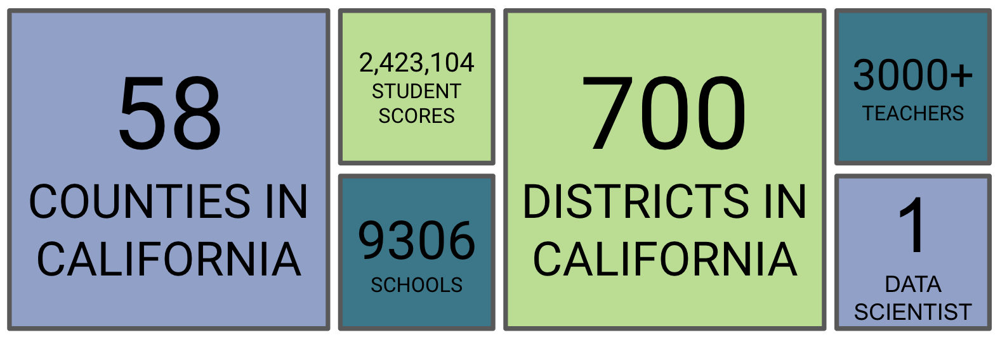
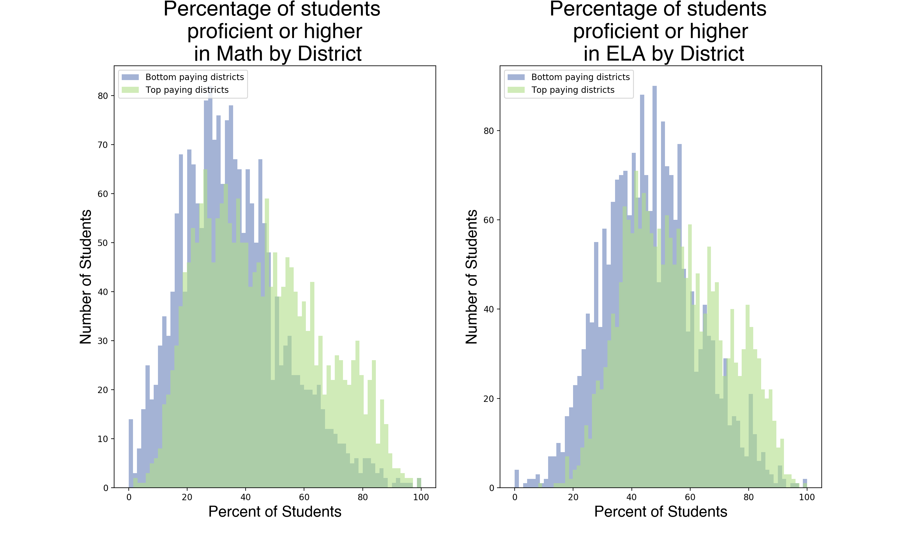

# Salaries and Standards

***Do students from top paying districts score the same or better than students who attend lower paying districts?***

**Questions to explore**
- Do districts with higher salary have higher test scores?
- Which county in California has the highest average teacher salary?
- Which county in California have the highest percentage of students meeting or exceeding standards?

**Data sources** 
- Three data sets were taken from California Department of Education from the 2018 - 19 school year.
    1. Data set on all Smarter Balanced (SBAC) scores of students in both ELA and Math for the State of California
    2. Text file identifying the codes used in SBAC data to identify County, District, and School by name
    3. Data set on teacher salary by Districts in the state of California

**Data description** 
- State testing data is in a large CSV file with over 2 million rows and over 30 columns such as: District code, School code, Grade, Percentage Standard Met, Percentage Standard Nearly Met, Area proficiency, etc.
- There is an additional District and School CSV that identifies the County, Distict, and School Names with their specific code in the SBAC file
- Students scores will fall into one of four groups: 
    - Standard exceeded
    - Standard met
    - Standard nearly met
    - Standard not Met
- For the purpose of this data exploration we are only interested in students who fall into the "exceed" or "met" category. 
- The terms "proficient" and "standards met" are interchangeable 
- Teacher salary data reports aggregated data on the lowest, average, and highest reported salary for each district in California
- Teacher salary data only matches up to the SBAC data by District Name, which can take on many forms. 

**Common Terms**
- Counties ---> Districts --> Schools
- There are 58 Counties in California with over 900 Districts. Each District has their own number of schools and serve anywhere between 596,937 (Los Angeles Unified) to 4 students (Panoche Elementary)
- Districts that education students in grades TK - 12 typically have "Unified" in their name
- Districts that educate students in grades TK - 8 can either go by "Union" or "Elementary"
- Districts that educate students in grades 9 - 12 generally have "High" in their name
- Students in grade 3 - 8 and 11 will take both the ELA and Math SBAC (Smarter Balanced Assessment Consortium)

**Data Exploration**

- We will begin by looking at the money. 700 district salaries is a lot of for one bar chart, so lets look at each District in each County and find the highest average salary offered in that County. You'll find the median salary running across the middle of the graph so we can see which counties fall above or below that line.

- Now let's at a look at each district's average teacher salary vs the percentage of students who met or exceeded standard in that same district.

- The above graph is alot - in fact, it is over 8,000 dots! Lets group each District and look at them individually and see how that District's average salary compares to the percentage of students who met or exceeded standard for the whole county. 

**Hypothesis Testing**

- After examining the graphs above we can see that as we move along the x-axis the scores do increase, but to better understand the correlation we'll take a look at some correlation heat maps.

- This tells us that ...

- Great! Now that we have our student scores seperated out by ELA and Math let's get to our main question. **Do students from top paying districts score the same or better than students who attend lower paying districts?**

- Lets seperate out the top paying districts from the bottom paying districts by splitting them at the Median and see how their students perform on both ELA and Math tests. We have fairly equal data frames of about 2100 districts in each, lets run a t-test with the standard alpha level of 0.05 to test our null hypothesis that was created prior to seeing any of this data.

*Null Hypothesis: Students from top paying districts score the same as students from lower paying districts.*

*Alternate Hypothesis: Students from top paying districts score better than students from lower paying districts.*

- When we perform the t-test with scipy.stats for our ELA scores we get a p value 5.484 e-64. WOW! That is significantly less than our alpha level which tells us we can reject our null hypothesis and accept the alternate.
- The results of our t-test with scipy-stats for our Math score is a little different, we receive a p-value of 1.4068 e-60. Another significat number, telling us we can reject our null hypothesis and accept the alternate.

*Students from top paying districts DO score better than students from lower paying districts.* 

- Lets visualize the spread

- Lets look at just one more graph to really hit this idea home. The cumulative distribution function (CDF) of each test comparing the top and lower paying districts. 

- Okay one last graph, saved the best for last! We can visualize the map of California and closely compare each county.

**Conclusion**
- Yes, we want our students to be able to read, write and perserver though difficult math problems. It has been shown above that there is a lot of work that needs to be done to ensure our students are meeting standards for their grade level. 
- We also need to ensure that adults are entering the educational career field. Teacher shoul feel respected and appreciated for the hard work that it takes to do their job. 
- It has been shown that students from higher paying districts perform better, but I would not say it is solely because teachers are paid more. Those districts most likely offer a larger variety of instruction (like music, art, and specialized classes), on campus clubs, and maybe even mental health supports that we know can benefit the whole child. 